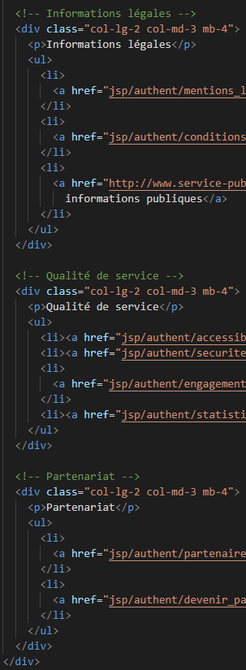

# Compte Rendu du Projet de Reproduction de l'ancien Site du Service Public

Nassim Belkacem
:date: 2024-10-05

## Introduction

Ce projet a pour objectif de recréer une ancienne version d'une page du site du service public, en utilisant un squelette HTML fourni et en intégrant des styles CSS personnalisés avec **Bootstrap** pour garantir une mise en page réactive. L'objectif final est de produire un site fidèle à la capture d'écran fournie tout en adoptant les bonnes pratiques modernes de développement front-end.

## Technologies Utilisées

- **HTML5** : pour la structure de la page.
- **CSS3** : pour la mise en page et les styles personnalisés.
- **Bootstrap** : pour la gestion du responsive design à travers des grilles et des composants prédéfinis.
- **Visual Studio Code** avec l'extension Live Server pour un développement en temps réel.

## Étapes du Développement

### Structure de la page HTML

1. Organisation en plusieurs sections :
   - **header** : contient le logo, la barre de recherche.
   - **navbar** : contient la barre de navigation.
   - **section principale** : contient les articles principaux ainsi qu'une colonne latérale (aside).
   - **footer** : réorganisé en utilisant une grille Bootstrap, et en contient les copyrights.

### Mise en Page CSS

Ici nous allons aborder chaque section de la page et expliquer quels ont été les choix pris pour reproduire du mieux possible l'ancienne version du site du Service public.

- **Header :**

  - Pour le header on gère d'abord l'image:
  
    

  - Ensuite on gère le header en mettant une flexbox et séparant les éléments de part et d'autres de chaque côté:

    

  - Puis on modifie la barre de recherche et le bouton OK:

    

Ainsi on termine le header en utilisant Flexbox. Grâce aux propriétés css on a gérer le responsif du header, et on a modifier l'apparence des éléments de sorte à que ça ressemble à la version originale

- **Navbar :**

  - Pour la navbar, on fixe tout l'élément avec un `width: 100%` de sorte à que la navbar prend toute la largeur, ensuite on définie des propriétés pour tout les éléments li du ul dans la navbar grâce à la class `ul.menu`.
    La navbar étant constitué de plusieurs liste désordonnées différentes on est obligé de faire des petits changements de manière précises pour que ça ne s'affecte pas à tout les éléments.

    

- **Section Principal :**

  - Pour La section principal, il a fallut gérer l'espacement du main et du aside, donc voici pour le code css pour la section:

    

  - Ensuite il faut gérer le main, son style et son alignement à la navbar et au header, ici on préfére utiliser des class personnalisés pour la clareté de ce qu'on vise, on définit la largeur du main de 100% de sorte à que le main prenne tout l'espace disponible et soit aligné aux 3 premiers `ul a` :

    

  - Et pour le aside, c'est quasiment la même personnalisation mais on vise des éléments différents avec des class différentes pour par exemple faire en sorte que l'élement p "Toutes les astuces" et "Toutes les actualités" ne soient pas de la même couleur.

    

- **Footer :**
  - Utilisation des classes `.row` et `.col-md-4` de Bootstrap pour diviser le footer en   trois sections.
    Ajout de marges et de paddings personnalisés pour garantir un espacement adéquat entre les éléments.

    - Voici le footer css pour le style: 
    

    - Voici le footer html pour la grille **Bootstrap** :

    

### Réactivité et Adaptation Mobile

1. Utilisation de la grille Bootstrap pour gérer les dispositions des éléments sur petits écrans.
2. Test en direct sur plusieurs résolutions à l'aide de **l'extension Live Server** de VS Code.
3. Utilisation des media queries pour assurer le responsif. 

## Difficultés Rencontrées

1. Ajustement des sous-menus pour qu'ils s'affichent correctement avec les bonnes animations au survol.
2. Réorganisation du footer pour qu'il soit aligné à la maquette, en utilisant la grille Bootstrap tout en respectant le style d'origine.
3. Assurer la compatibilité du design entre les grands et petits écrans (réactivité du projet).

## Résultats

Le projet est terminé avec succès, en suivant les exigences du cahier des charges :

- Reproduction fidèle (plus ou moins) de la maquette fournie.
- Design réactif et utilisable sur différentes tailles d'écrans.
- Utilisation de bonnes pratiques modernes pour structurer le code HTML et CSS.

## Conclusion

Ce projet a permis de mettre en pratique plusieurs notions du développement front-end, notamment l'intégration avec Bootstrap et Flexbox pour la gestion de la mise en page. Il a aussi permis de se familiariser avec les contraintes du responsive design et les techniques d'optimisation de la présentation sur différents appareils.
